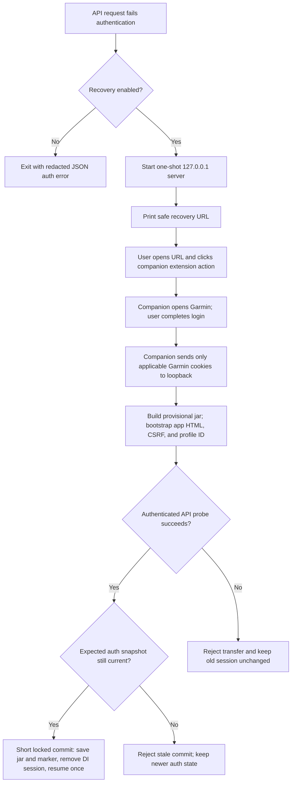

# Garmin Connect Transfer Protocol

Status: reverse-engineered implementation specification
Web traffic observed: 2026-07-17 against Garmin Connect Web `5.26.1.1`
Private-DI login: source-inspected and mock-verified, not live-verified
Target: a strict TypeScript CLI that reads Garmin Connect data without a browser once authenticated; Chrome is used only for explicit session recovery

Implementation boundaries are enforced by source-graph and contract tests.

## 1. Scope and evidence

This document describes two private Garmin interfaces used by the CLI:

1. the cookie + CSRF protocol used by the authenticated Garmin Connect web application at `https://connect.garmin.com/app/`;
2. an experimental Garmin Connect Mobile private-DI service-ticket, bearer-token, and API protocol.

It was produced from Chrome DevTools Protocol network traces of an already authenticated account. The trace covered:

- activity list and one representative activity detail;
- sleep;
- Pulse Ox;
- respiration;
- heart rate;
- stress;
- Body Battery;
- training status and its supporting metrics;
- HRV status.

No Garmin interface in this document is a published, stable public contract. Endpoint paths, client identifiers, headers, and response fields can change without notice. The CLI must therefore keep decoded wire JSON available, validate known fields at runtime, and fail clearly when the contract changes.

No write endpoint was exercised. The first CLI version should be read-only.

### Evidence labels

- **Web-observed**: present in the 2026-07-17 authenticated Chrome network trace or response body. Unqualified “observed” in the endpoint catalogue means web-observed.
- **Source-inspected**: derived from current third-party client source, then implemented locally; not independently confirmed against Garmin in this repository.
- **Mock-verified**: exercised by deterministic unit or full-process tests against synthetic Garmin responses.
- **Live-verified**: exercised by this CLI against an explicitly authorized Garmin account. No private-DI login or complete CLI live run currently has this label.
- **Derived**: a direct implementation consequence of observed behavior.
- **Unverified**: not exercised and must not be treated as an established Garmin contract.

The authenticated web trace is live protocol evidence, but it is not a recorded passing run of the finished CLI. These evidence types must not be conflated.

Public references used for corroboration and risk context:

- [`python-garminconnect` client authentication source at the inspected revision](https://github.com/cyberjunky/python-garminconnect/blob/2ae0eb5d6e56a13bc0194e229992c3a7d855253c/garminconnect/client.py);
- [`python-garminconnect` endpoint source](https://github.com/cyberjunky/python-garminconnect/blob/master/garminconnect/__init__.py);
- [Garmin Connect Developer Program FAQ](https://developer.garmin.com/gc-developer-program/program-faq/) and [official Garmin Health API](https://developer.garmin.com/gc-developer-program/health-api/).

Those sources do not make the private interfaces official. Garmin's approved developer program is the stable path for accepted business integrations; this CLI is an independent personal read-only client.

All account IDs, device IDs, activity IDs, names, locations, token values, and measurements in this document are placeholders or types, not captured personal values.

## 2. Protocol overview

### 2.1 Origins and route families

| Purpose | Origin/path | Status |
|---|---|---|
| Browser application | `https://connect.garmin.com/app/...` | Web-observed |
| Web authenticated JSON API | `https://connect.garmin.com/gc-api/...` | Web-observed |
| Mobile SSO login/MFA | `https://sso.garmin.com/mobile/api/...` | Source-inspected, mock-verified |
| Private-DI token service | `https://diauth.garmin.com/di-oauth2-service/oauth/token` | Source-inspected, mock-verified |
| Private-DI data API | `https://connectapi.garmin.com/...` | Source-inspected, mock-verified |
| Web SSO host advertised by the app | `https://sso.garmin.com/sso` | Web-observed as configuration only |

The page routes are UI routes. The web backend uses `gc-api`; the private-DI backend uses bearer-authenticated service routes without the `/gc-api` prefix. Neither data backend requires rendering the UI after a valid session exists.

### 2.2 HTTP behavior

The sampled traffic used:

- HTTPS with HTTP/2 in Chrome;
- `GET` for every data request documented here;
- JSON response bodies, except valid `204 No Content` responses observed for an activity playlist with no data and, on an old no-data date, heat/altitude acclimation plus HRV daily/range;
- Brotli response encoding in Chrome;
- `cache-control: no-cache, no-store, private` and `pragma: no-cache` on sampled API responses.

HTTP/2 is transport behavior, not a client requirement. A Node client may use HTTP/1.1 if Garmin negotiates it successfully.

### 2.3 Authentication and CSRF

Every sampled `gc-api` data request had:

1. browser-managed Garmin session cookies;
2. a `Connect-Csrf-Token` request header;
3. no `Authorization` header.

The authenticated application HTML contained:

```html
<meta name="csrf-token" content="...">
```

It also exposed these bootstrap signals:

```text
window.viewerIsAuthenticated = true
window.GAUTH_HOST = "https://sso.garmin.com/sso"
window.VIEWER_USERPREFERENCES.displayName = "<profile UUID>"
```

`displayName` is misleadingly named: in the observed account it was the UUID-like profile identifier required by several API paths.

The `Connect-Csrf-Token` value and the session cookie jar are secrets. They must never be printed in normal output, debug logs, errors, telemetry, shell history, or fixtures.

#### Verified authenticated-session bootstrap

Once an authenticated cookie jar is available, the CLI can bootstrap an API session as follows:

1. `GET https://connect.garmin.com/app/home` with redirects enabled and an opaque cookie jar.
2. Reject the response as unauthenticated unless the final page is Garmin Connect application HTML and contains `viewerIsAuthenticated = true`.
3. Parse `meta[name="csrf-token"]` and retain its value only in memory.
4. Parse the profile UUID from `VIEWER_USERPREFERENCES.displayName`, or obtain it from a separately validated profile response.
5. Send the cookie jar and `Connect-Csrf-Token` on every `gc-api` request.
6. If Garmin returns an authentication redirect, HTML instead of the expected JSON, or `401`, report `AUTH_REQUIRED`. On a web `403`, bootstrap once for a fresh CSRF token; if the retried request is still forbidden, report `AUTH_FORBIDDEN`.

Do not infer authentication solely from a `200` status: a login page can also be returned successfully after redirects.

#### Experimental private mobile-DI login

The web SSO form/redirect sequence still was not captured. Instead, the implementation uses a separate browserless flow modeled on Garmin Connect Mobile's private-DI client. This flow is **source-inspected and mock-verified, not live-verified**. It must remain labeled experimental until an authorized live account proves login, MFA, refresh, and representative data calls.

The implemented ticket request is:

```http
POST /mobile/api/login?clientId=GCM_IOS_DARK&locale=en-US&service=https%3A%2F%2Fmobile.integration.garmin.com%2Fgcm%2Fios HTTP/1.1
Host: sso.garmin.com
Content-Type: application/json
Accept: application/json, text/plain, */*

{
  "username": "<secret>",
  "password": "<secret>",
  "rememberMe": true,
  "captchaToken": ""
}
```

The SSO HTTP client keeps a private cookie jar between login and MFA. Recognized `responseStatus.type` values are:

| Value | CLI action |
|---|---|
| `SUCCESSFUL` | Require a non-empty `serviceTicketId` and continue. |
| `MFA_REQUIRED` | Require `customerMfaInfo.mfaLastMethodUsed`, obtain one code, and call the MFA endpoint. |
| `INVALID_USERNAME_PASSWORD` | Return `AUTH_INVALID_CREDENTIALS`. |
| `CAPTCHA_REQUIRED` | Return `AUTH_BROWSER_RECOVERY_REQUIRED`. |
| Unknown value/schema | Return `PROTOCOL_CHANGED`; never guess success. |

MFA verification is:

```http
POST /mobile/api/mfa/verifyCode?clientId=GCM_IOS_DARK&locale=en-US&service=https%3A%2F%2Fmobile.integration.garmin.com%2Fgcm%2Fios HTTP/1.1
Host: sso.garmin.com
Content-Type: application/json

{
  "mfaMethod": "<method from login response>",
  "mfaVerificationCode": "<secret>",
  "rememberMyBrowser": true,
  "reconsentList": [],
  "mfaSetup": false
}
```

A successful MFA response must also contain a non-empty `serviceTicketId`. HTML or `403` during either SSO request is treated as a bot/browser challenge, not parsed as a successful login. `429` and `5xx` are classified separately from credentials. Passwords and MFA codes are accepted through hidden terminal input, stdin, or explicit environment variables; the password is never a CLI argument.

The service ticket is exchanged at:

```http
POST /di-oauth2-service/oauth/token HTTP/1.1
Host: diauth.garmin.com
Authorization: Basic base64("<private-DI-client-id>:")
Content-Type: application/x-www-form-urlencoded

client_id=<private-DI-client-id>
&service_ticket=<secret-ticket>
&grant_type=https%3A%2F%2Fconnectapi.garmin.com%2Fdi-oauth2-service%2Foauth%2Fgrant%2Fservice_ticket
&service_url=https%3A%2F%2Fmobile.integration.garmin.com%2Fgcm%2Fios
```

The implementation tries these source-inspected client IDs in order until one accepts the ticket:

```text
GARMIN_CONNECT_MOBILE_ANDROID_DI_2025Q2
GARMIN_CONNECT_MOBILE_ANDROID_DI_2024Q4
GARMIN_CONNECT_MOBILE_ANDROID_DI
GARMIN_CONNECT_MOBILE_IOS_DI
```

A token response must contain a non-empty `access_token`; `token_type`, when present, must be `bearer`. The optional `refresh_token`, `expires_in`, and `refresh_token_expires_in` values are strictly decoded. The resulting access token is immediately validated with:

```http
GET /userprofile-service/socialProfile HTTP/1.1
Host: connectapi.garmin.com
Authorization: Bearer <secret-access-token>
Accept: application/json
```

The token session refreshes 15 minutes before a known access-token expiry. Refresh uses the same token endpoint and selected client ID:

```text
grant_type=refresh_token
client_id=<selected-client-id>
refresh_token=<secret-refresh-token>
```

Rotated tokens are saved before validation. Concurrent callers in one process share one refresh promise; independent processes serialize refresh through `auth-state.lock` and re-read the token after acquiring it so they do not refresh a stale token twice. A data request rejected as unauthorized forces one refresh and retries the operation once. A rejected refresh becomes `AUTH_REQUIRED`; it is never retried indefinitely.

Private-DI data requests use `https://connectapi.garmin.com`, Garmin-mobile-identifying headers, `Authorization: Bearer`, and `Accept: application/json`. Every data feature declares its canonical web path. When a private-DI route differs, that same feature also owns the optional `diPath` shown below:

| Canonical feature path | Private-DI path |
|---|---|
| `/gc-api/sleep-service/sleep/dailySleepData` | `/wellness-service/wellness/dailySleepData/{profileId}` |
| `/gc-api/wellness-service/wellness/dailyHeartRate` | `/wellness-service/wellness/dailyHeartRate/{profileId}` |
| `/gc-api/wellness-service/wellness/daily/spo2acclimation/{date}` | `/wellness-service/wellness/daily/spo2/{date}` |
| `/gc-api/metrics-service/metrics/trainingstatus/daily/{date}` | `/metrics-service/metrics/trainingstatus/aggregated/{date}` |
| every other `/gc-api/...` path | omit `diPath`; strip only the `/gc-api` prefix |

This keeps each exceptional route beside the dataset that owns it and prevents a shared transport route table from coupling unrelated features. `DiGarminDownloadService` only validates a supplied DI route, expands its optional single `{profileId}` placeholder, or strips `/gc-api` for the default case. The four exceptional declarations and representative unchanged routes are mock-verified. Current live compatibility remains unproved.

Backend selection is deterministic but is **not** inferred from credential-file presence. After the first state transition, `active-backend.json` is the sole authority and has this exact schema:

```ts
interface StoredAuthStateV3 {
  readonly schemaVersion: 3;
  readonly activeBackend: "private-di" | "web-cookie" | null;
  readonly revision: string; // UUID, regenerated for every transition
  readonly savedAt: string;  // ISO timestamp
}
```

`private-di` selects the bearer backend, `web-cookie` selects the cookie/CSRF backend, and `null` is a revisioned disconnected tombstone. A missing file represents never-initialized disconnected state; it is distinct from a persisted null-backend snapshot. Inactive leftover credential files are ignored, while a non-null marker whose selected credential is missing is corrupt state. Other schema versions, missing/extra fields, invalid UUIDs, and invalid timestamps are rejected rather than migrated through a compatibility path.

Authentication state commits and DI refreshes use the owner-only, cross-process `auth-state.lock`. Network login and browser-cookie verification happen outside that lock. Every persisted transition receives a new random revision. Recovery records the complete expected backend/revision snapshot before waiting for the browser, or records the distinct missing state if the CLI has never initialized authentication. Under the short commit lock it requires an exact match before writing cookies. Consequently, both a missing-to-disconnected transition and a disconnected-to-login-to-disconnected ABA sequence are detected even though the effective backend is `null` before and after. A mismatch returns retryable `AUTH_STATE_CHANGED` without committing the prepared cookie jar.

For an unchanged snapshot, the new credential and revisioned `active-backend.json` are each written atomically before the superseded credential is removed. Successful private-DI login commits `private-di`; successful browser recovery commits `web-cookie`; disconnect writes a fresh `activeBackend: null` tombstone before deleting both session files. That revisioned marker is the hard-cutover point, so interrupted cleanup cannot silently reactivate an old backend.

If the marker hard cutover succeeds but credential cleanup or lock release then fails, the operation returns retryable `AUTH_TRANSITION_FINALIZATION_FAILED` instead of implying that no state changed. Its redacted details are:

```ts
interface AuthTransitionFinalizationFailureDetails {
  readonly transitionCommitted: true;
  readonly activeBackend: "private-di" | "web-cookie" | null;
  readonly credentialCleanupCompleted: boolean;
  readonly credentialsMayRemain: boolean;
  readonly nextCommand: "gconnect auth disconnect" | "gconnect auth status";
  readonly retryable: true;
}
```

When cleanup did not complete, `nextCommand` is `gconnect auth disconnect`; when only post-cleanup lock release failed, it is `gconnect auth status`. Consumers must inspect this contract rather than retrying the original transition as though it were uncommitted.

#### Connection recovery tool

When an established session expires or the CLI cannot authenticate, the implementation provides an explicit recovery command:

```text
gconnect auth recover
```

An interactive activities, health, performance, or `api get` command starts the same flow once after `AUTH_REQUIRED`, `AUTH_FORBIDDEN`, or `AUTH_BROWSER_RECOVERY_REQUIRED`, then invokes the original command once with the same validated input. Those data commands declare `--recover-auth` to enable the behavior explicitly and `--no-auth-recovery` to disable it. The flags are not global. Separately, `auth login` automatically falls back only after Garmin's recognized CAPTCHA/bot-challenge classification; its `--no-auth-recovery` option disables that fallback. Invalid credentials, MFA rejection, DNS, TLS, offline, rate-limit, server, and protocol errors never start recovery because opening a browser cannot repair them.

The implemented terminal experience is:

```text
Garmin authentication requires browser recovery.

Open this one-time link in Chrome with the GConnect Browser Companion installed:
http://127.0.0.1:49173/recover/7V...one-time-nonce

With the recovery page active, click the GConnect Browser Companion action to approve the cookie transfer (find it in Chrome's Extensions/puzzle menu if it is not pinned).

Waiting for Garmin Connect... Press Ctrl-C to cancel.
```

The URL may be copied or opened manually. `--open` may additionally ask the operating system to open it, but manual copy/paste must always work and should be the default in environments where opening a browser is unavailable. Both the terminal and loopback page tell the user to click the GConnect Browser Companion extension action to approve that one recovery.

After the provisional browser session passes its authenticated probes, the runner prints `Garmin browser session verified; committing authentication state.` The CLI then performs the revision-checked state commit and, for command-triggered recovery, resumes the selected data command without printing credentials or duplicating its JSON result.

The printed URL contains only a high-entropy one-time nonce and loopback address. It must never contain a cookie, CSRF token, Garmin password, MFA code, profile ID, or activity/health data.

The nonce, loopback bind, exact `Host`, sender-URL check, explicit extension-action approval, and single-use listener prevent remote guessing, passive-page capture, cross-origin submission, and replay after completion. They do **not** authenticate the CLI process to the extension against another process running as the same OS user: a malicious same-user process could present a lookalike loopback flow and try to persuade the user to approve it. The companion and owner-only state files assume same-user local processes are trusted; defending against that threat would require OS-authenticated IPC or a separately provisioned trust key, which is not implemented.

##### Browser security constraint

A normal web redirect cannot transfer Garmin cookies to the CLI:

- cookies are scoped to Garmin domains;
- `HttpOnly` cookies are unavailable to page JavaScript;
- a browser does not send Garmin cookies to `127.0.0.1`;
- redirect query parameters contain cookies only if Garmin explicitly puts a one-time ticket/code there.

Therefore the implemented recovery tool has one completion mechanism: the bundled **browser companion**. A loopback ticket callback remains a possible future simplification, but it must not be enabled until a trace proves Garmin returns an exchangeable one-time ticket/code to an approved callback.

Do not implement a fake callback that merely waits for the user to visit Garmin and then assumes the CLI has the new session. Do not ask the user to paste a raw `Cookie` header into the terminal.

##### Recovery state flow



##### Loopback server contract

The CLI creates the listener before printing the URL. The following contract is implemented and mock-verified:

- Bind only to `127.0.0.1`, never `0.0.0.0`.
- Ask the OS for an unused port. No public `--port` override exists.
- Generate at least 256 bits of cryptographically secure random state.
- Put the state in an unguessable path, not in logs beyond the single user-facing URL.
- Accept only the expected `Host` and loopback remote address.
- Set `Cache-Control: no-store`, `Referrer-Policy: no-referrer`, and a restrictive Content Security Policy on local pages.
- Allow one valid session submission, acknowledge it with `202 Accepted`, and reject concurrent duplicates while asynchronous verification runs.
- Retain the terminal `complete` or `failed` status for one poll, with a five-second close fallback, then invalidate the nonce and close the listener.
- Default timeout: five minutes; `auth recover --timeout` accepts 60 through 900 seconds.
- On `Ctrl-C`, timeout, or terminal exit, close the listener and invalidate the nonce.
- Cap request/header/body sizes before parsing.
- Do not enable wildcard CORS.

Implemented local endpoints:

```text
GET  /recover/{nonce}             local instruction page with absolute deadline meta
GET  /recover/{nonce}/status      redacted polling state only
POST /recover/{nonce}/session     validate transfer, return 202, verify asynchronously
```

The local HTML embeds the listener's absolute `expiresAt` epoch-millisecond deadline in a non-sensitive meta element. Its restrictive Content Security Policy permits no page fetch; after approval the content script sends messages to the extension worker instead. The public status response exposes only `waiting`, `verifying`, `complete`, or `failed`, plus that same `expiresAt`. The worker validates the deadline on every bounded status step, and the page may only shorten its original deadline, never extend it. `POST /session` strictly reads and decodes the transfer, changes the state to `verifying`, returns `202 { "status": "verifying" }`, and continues Garmin verification inside the listener lifecycle; `202` is acceptance, not authentication success. Worker polls continue until `complete` or `failed`. A terminal status is retained for the next poll; the listener remains referenced during a five-second lifecycle grace period and closes sooner when that poll arrives. Internal cancellation maps to public `failed` before the listener closes. Status never exposes cookie values, verification details, or Garmin response bodies. Headers are capped at 8 KiB; the transfer body defaults to 64 KiB and cannot be configured above 1 MiB internally. Unexpected hosts, remote addresses, paths, methods, content types, schemas, nonces, repeated submissions, and oversized bodies are rejected.

##### Preferred ticket callback

If a future SSO trace proves Garmin supports an approved loopback `redirect_uri`/`service` and returns a one-time code or ticket, the flow should be:

1. The local `/recover/{nonce}` page redirects to the exact verified Garmin authorization URL.
2. The request binds the callback to the nonce/state.
3. Garmin redirects to `/recover/{nonce}/callback` with a short-lived ticket/code, not cookies.
4. The CLI validates state and exchanges the ticket with Garmin using its own HTTP cookie jar.
5. The CLI performs the authenticated bootstrap and probe described below.

The callback must reject missing/duplicate state, unexpected parameters, reused tickets, and callbacks received after timeout. Exact Garmin parameter names and exchange endpoints remain unverified and must not be added until captured.

##### Browser companion

Garmin establishes web cookies in the user's browser, so the bundled unpacked Chrome Manifest V3 extension is the implemented narrow bridge. It is preferable to reading browser profile databases, enabling remote debugging, or asking for a copied cookie string.

The companion has only `cookies` permission plus exact host access to `https://connect.garmin.com/*` and `http://127.0.0.1/*`. It is implemented to:

- observe a Garmin application URL remaining fully loaded and unchanged for two seconds;
- read cookies applicable to that exact URL through the browser cookie API, including `HttpOnly` cookies;
- send a one-time session snapshot directly to the CLI loopback endpoint;
- never read page content, activities, health payloads, history, passwords, or cookies unrelated to the Garmin application URL.

Opening the loopback recovery page does not start the extension. The user must click the GConnect Browser Companion extension action while that tab is active; only that explicit action sends the approval message that starts polling. The recovery page content script then sends a worker message every 500 ms. It retains only non-cookie continuation state: the deadline read from page metadata, Garmin tab ID, stable application URL, and the time that URL first became ready. It performs no fetch itself. Each message asks the Manifest V3 worker to perform one bounded step. A worker step checks `/status` with a five-second request limit, opens or reuses the Garmin tab, reports readiness, or—after the same application URL has been fully loaded for at least two seconds—queries the exact application cookies and posts them with a 15-second request limit.

The worker stores no active recovery set or other continuation state and does not rely on one message remaining open throughout user login or Garmin verification. It may restart between polls. A `202` submission acknowledgement and loopback `verifying` state are returned as waiting so another worker poll can observe completion; `409` during an in-progress submission is handled the same way. A transient worker/loopback failure returns a retry state. Every subsequent page message causes the worker to re-read `/status`; `complete` and `failed` are terminal. The user completes password/MFA/CAPTCHA directly on Garmin throughout this process.

The companion transfer body is internal protocol, versioned independently:

```ts
interface BrowserSessionTransferV2 {
  readonly protocolVersion: 2;
  readonly nonce: string;
  readonly source: "browser-companion";
  readonly cookies: readonly BrowserCookieSnapshot[];
}

interface BrowserCookieSnapshot {
  readonly name: string;
  readonly value: string;
  readonly domain: string;
  readonly hostOnly: boolean;
  readonly path: string;
  readonly secure: boolean;
  readonly httpOnly: boolean;
  readonly sameSite: "unspecified" | "no_restriction" | "lax" | "strict";
  readonly expirationDate?: number;
}
```

The extension queries cookies by the exact URL `https://connect.garmin.com/app/home`, not every Garmin/SSO/browser cookie. Protocol v2 carries Chrome's `hostOnly` flag. The CLI omits the `Domain` attribute when reconstructing a host-only cookie and requires the cookie library to return the imported cookie; this preserves `__Host-*` prefix rules instead of silently dropping a required session cookie. Partitioned-cookie metadata is not represented and must not be guessed if Garmin begins relying on it. The POST goes directly from extension background code to the one-time loopback URL; raw cookies never enter the local HTML page DOM or JavaScript console.

The CLI must treat the transfer as untrusted input. Validate domains, paths, size, cookie attributes, nonce, protocol version, timeout, and single-use status. Imported cookies are provisional until Garmin independently verifies them.

##### Independent verification and atomic replacement

Before opening the browser, the auth service records the complete current authentication snapshot. This is either a backend (possibly the disconnected `null` tombstone) plus its revision, or the distinct never-initialized missing state. After a companion submission, the CLI:

1. strictly imports every cookie into a temporary in-memory jar while preserving host-only semantics;
2. `GET /app/home` using that jar;
3. verifies `viewerIsAuthenticated = true`;
4. extracts a fresh CSRF token and profile ID;
5. calls one small read-only probe, `GET /gc-api/userprofile-service/userprofile/user-settings/`;
6. accepts only an expected JSON response and returns a prepared, exactly-once session commit without persisting it yet;
7. acquires `auth-state.lock` only after all browser waiting and network verification are finished;
8. re-reads the state and rejects with retryable `AUTH_STATE_CHANGED` unless marker presence, backend, and revision exactly match the expected snapshot;
9. atomically writes the owner-only `web-session.json` file;
10. atomically writes a new revisioned `active-backend.json` selecting `web-cookie`;
11. deletes the now-inactive private-DI session and releases the lock;
12. resumes the command that originally failed, when recovery was command-triggered.

If provisional bootstrap or the probe fails, the previously saved web session remains unchanged and the error is redacted. The error retains only a safe phase (`cookie-import`, `home-bootstrap`, or `user-settings-probe`), controlled reason code, and optional HTTP status. Cookie values, response bodies, URLs containing secrets, and exception text are never returned. The user can start a new recovery command to get a new nonce. Old and new cookie jars are never merged.

##### Interactive and automated behavior

Default behavior for commands that declare recovery options:

- interactive TTY: start recovery once, wait, verify, and resume automatically;
- `--recover-auth`: start recovery without prompting, including outside a TTY;
- `--no-auth-recovery`: fail immediately with the original redacted authentication error;
- non-interactive execution: fail unless `--recover-auth` or the explicit `auth recover` command was used;
- concurrent recovery in the same runner: reject the second attempt with `AUTH_RECOVERY_IN_PROGRESS`.

`auth login` is a separate special case: it automatically falls back only for `AUTH_BROWSER_RECOVERY_REQUIRED` and accepts `--no-auth-recovery` to opt out. It does not accept `--recover-auth` because the browser-challenge fallback is already automatic.

`auth-state.lock` serializes short authentication commits, disconnect, and DI refresh across CLI processes; it is not held while a user logs in through Chrome or while Garmin verifies provisional cookies. A contender waits for a bounded interval and then returns retryable `AUTH_STATE_BUSY`; abandoned owner processes and sufficiently stale malformed lock files are detected conservatively. The lock file is removed after the operation and never selects the active backend itself.

Connection failures must be classified before recovery:

| Failure | Start browser recovery? |
|---|---|
| Authentication redirect, `401`, expired/missing session | Yes |
| `403` after one web CSRF refresh | Yes, once |
| DNS/TLS/offline/connection refused | No; run connectivity diagnostics |
| `429` | No; report `Retry-After` metadata when provided |
| Garmin `5xx` | No; bounded retry |
| JSON schema/protocol change | No; report protocol error |

For remote/SSH execution, a `127.0.0.1` URL refers to the remote host, not the user's desktop. The runner detects common SSH environment variables and prints an `ssh -L <port>:127.0.0.1:<port> <remote-host>` hint. It never binds publicly as an automatic workaround.

##### Recovery component boundary

```ts
type RecoveryStage =
  | "waiting"
  | "verifying"
  | "complete"
  | "failed"
  | "cancelled";

interface AuthRecoveryRequest {
  readonly timeoutMs: number;
  readonly openBrowser: boolean;
}

interface AuthRecoveryRunner {
  recover(request: AuthRecoveryRequest): Promise<PreparedAuthRecovery>;
}

interface PreparedAuthRecovery {
  readonly mechanism: "browser_companion";
  commit(): Promise<void>;
}
```

### 2.4 Common data requests

Minimal web-cookie request form:

```http
GET /gc-api/<service>/<resource> HTTP/1.1
Host: connect.garmin.com
Accept: application/json
Connect-Csrf-Token: <secret>
Cookie: <opaque Garmin cookie jar>
```

Chrome also sent normal browser headers such as `User-Agent`, `DNT`, and client hints. They are not proven application requirements. Start with the minimal headers and add a stable CLI `User-Agent` only if testing shows it is needed.

Private-DI request form:

```http
GET /<service>/<resource> HTTP/1.1
Host: connectapi.garmin.com
Accept: application/json
Authorization: Bearer <secret-access-token>
X-Garmin-Client-Platform: Android
X-GCExperience: GC5
```

The implementation also sends the source-inspected stable native-client headers documented in `src/auth/di/token-client.ts`. They are private protocol details, not proof that the CLI is an official mobile client.

### 2.5 Common response and error handling

Observed successful cases:

- `200` with JSON object or array;
- `204` with no body.

Apart from the observed activity-filter `400`, error status behavior is primarily mock-verified rather than comprehensively live-measured. Handle it conservatively:

| Condition | CLI result |
|---|---|
| `200` and valid expected JSON | success |
| `204` | `optionalJson` returns `null`; `json` passes `null` to its command decoder, so strict typed commands normally reject it while the raw API may return `null` |
| redirect or HTML where JSON is expected | `AUTH_REQUIRED` or `PROTOCOL_ERROR` |
| `401` | `AUTH_REQUIRED` |
| `403` after one CSRF refresh | `AUTH_FORBIDDEN` |
| `404` | `NOT_FOUND` |
| `429` | `RATE_LIMITED`; expose `Retry-After` when present, without automatic retry |
| `5xx` | retry only idempotent GETs with bounded exponential backoff |
| JSON validation failure | `PROTOCOL_CHANGED`, retaining redacted diagnostic metadata |

Never retry indefinitely. The implementation makes at most three attempts for network/`5xx` GET failures with bounded exponential delays. It does not retry `429`. Rate-limit thresholds were not measured.

`404` is never interpreted as “no data,” including through `optionalJson`. The observed playlist, old-date acclimation, and old-date HRV daily/range no-content cases use `204`; sparse `200` objects and arrays remain data and pass through their feature decoder.

## 3. Identifiers, dates, timestamps, and units

### 3.1 Identifiers

The protocol uses multiple identifier forms:

- profile UUID: a UUID-like string embedded in paths such as daily summary and daily events;
- activity ID: a JSON number and decimal path segment;
- activity UUID: an object containing a UUID string in some detail responses;
- device ID: a JSON number and also a dynamic object key.

JavaScript numbers are not safe for arbitrary 64-bit identifiers. The observed values fit normal JSON numbers, but the strict client should normalize IDs to strings at its public boundary:

```ts
type ProfileId = string & { readonly __brand: "ProfileId" };
type ActivityId = string & { readonly __brand: "ActivityId" };
type DeviceId = string & { readonly __brand: "DeviceId" };
```

Parse numeric IDs from JSON without arithmetic and stringify them immediately. Preserve raw JSON for audit/debugging.

### 3.2 Calendar dates

Daily endpoints use a local calendar date in `YYYY-MM-DD` form. The date is not an instant. The CLI must not derive it by truncating UTC time.

```ts
type CalendarDate = `${number}-${number}-${number}`;
```

Runtime validation must still enforce the exact four-digit year, two-digit month/day format and a real calendar date.

### 3.3 Timestamps

Observed response fields use several incompatible timestamp representations:

- ISO-like strings ending in names such as `GMT` or `Local`;
- epoch millisecond numbers in fields such as `startGMT`;
- compact time-series arrays whose first column is a numeric timestamp;
- `beginTimestamp` numeric values in activity summaries.

Do not apply one global timestamp decoder. Decode by field contract. Preserve the raw value alongside any normalized `Date`/ISO output when ambiguity remains.

### 3.4 Units

Summary endpoints return Garmin base units, not necessarily the user's display units. Examples observed in activity summaries and detail descriptors include:

- distance/elevation: meters;
- duration: seconds in summary JSON;
- speed: meters per second;
- heart rate: beats per minute;
- cadence: steps per minute;
- Pulse Ox: percent-like numeric reading;
- respiration: breaths per minute;
- HRV: milliseconds;
- Body Battery: dimensionless 0–100-style level.

Activity detail series include a descriptor `unit` object with `{ id, key, factor }`. Do not assume that `factor` should always be multiplied or divided; retain the raw metric and descriptor until fixtures prove the conversion semantics for each key.

## 4. Compact time-series encoding

Several wellness endpoints encode rows as arrays to reduce payload size. A descriptor list defines the meaning of each column.

Generic decoder:

```ts
interface IndexedDescriptor {
  readonly index: number;
  readonly key: string;
}

function decodeRows(
  descriptors: readonly IndexedDescriptor[],
  rows: readonly (number | null)[][],
): ReadonlyArray<Readonly<Record<string, number | null>>> {
  const ordered = [...descriptors].sort((a, b) => a.index - b.index);
  return rows.map((row) =>
    Object.fromEntries(ordered.map(({ index, key }) => [key, row[index] ?? null])),
  );
}
```

The production implementation must validate unique non-negative descriptor indexes and reject rows that are shorter than the highest required index. Unknown additional columns should be preserved in raw output.

Observed descriptor sets:

| Dataset | Columns in observed order |
|---|---|
| Heart rate | `timestamp`, `heartrate` |
| Respiration | `timestamp`, `respiration` |
| Respiration averages | `timestamp`, `averageRespirationValue`, `highRespirationValue`, `lowRespirationValue` |
| Stress | `timestamp`, `stressLevel` |
| Body Battery | `timestamp`, `bodyBatteryStatus`, `bodyBatteryLevel`, `bodyBatteryVersion` |
| Pulse Ox single values | `timestamp`, `spo2Reading`, `singleReadingPlottable` |
| Pulse Ox hourly averages | `timestamp`, `spo2Level`, `monitoringEnvironmentLevel` |
| Pulse Ox environment | `timestamp`, `monitoringEnvironmentLevel` |

Decode from descriptors rather than hardcoding the listed order.

## 5. Endpoint catalogue

All paths below are relative to `https://connect.garmin.com`.

### 5.1 Activities

#### List activities

```http
GET /gc-api/activitylist-service/activities/search/activities
    ?limit={limit}
    &start={start}
    [&startDate={YYYY-MM-DD}]
    [&endDate={YYYY-MM-DD}]
    [&activityType={typeKey}]
```

Observed request:

- `limit=20`;
- `start=0`;
- response: JSON array;
- array length: 20 for the sampled first page.

`start` is a zero-based offset in the observed first request. End-of-pagination behavior was not traced; the safe derived rule is to stop when the returned array length is less than `limit`, with a configurable maximum page count.

Representative activity fields observed:

```ts
interface ActivityListItemWire {
  readonly activityId: number;
  readonly activityUUID: string;
  readonly activityName: string;
  readonly startTimeLocal: string;
  readonly startTimeGMT: string;
  readonly endTimeGMT: string;
  readonly beginTimestamp: number;
  readonly activityType: Readonly<Record<string, unknown>>;
  readonly eventType: Readonly<Record<string, unknown>>;
  readonly distance: number;
  readonly duration: number;
  readonly elapsedDuration: number;
  readonly movingDuration: number;
  readonly elevationGain: number;
  readonly elevationLoss: number;
  readonly averageSpeed: number;
  readonly maxSpeed: number;
  readonly calories: number;
  readonly bmrCalories: number;
  readonly averageHR: number;
  readonly maxHR: number;
  readonly averageRunningCadenceInStepsPerMinute: number;
  readonly maxRunningCadenceInStepsPerMinute: number;
  readonly steps: number;
  readonly aerobicTrainingEffect: number;
  readonly anaerobicTrainingEffect: number;
  readonly vO2MaxValue: number;
  readonly activityTrainingLoad: number;
  readonly differenceBodyBattery: number;
  readonly moderateIntensityMinutes: number;
  readonly vigorousIntensityMinutes: number;
  readonly startLatitude: number;
  readonly startLongitude: number;
  readonly endLatitude: number;
  readonly endLongitude: number;
  readonly locationName: string;
  readonly timeZoneId: number;
  readonly deviceId: number;
  readonly manufacturer: string;
  readonly lapCount: number;
  readonly sportTypeId: number;
  readonly trainingEffectLabel: string;
  readonly splitSummaries: readonly unknown[];
  readonly userRoles: readonly unknown[];
  readonly privacy: Readonly<Record<string, unknown>>;
  readonly manualActivity: boolean;
  readonly favorite: boolean;
  readonly hasPolyline: boolean;
  readonly hasImages: boolean;
  readonly hasVideo: boolean;
  readonly hasSplits: boolean;
  readonly hasIntensityIntervals: boolean;
  readonly hasHeatMap: boolean;
  readonly [additionalField: string]: unknown;
}
```

The live sample contained more sport-specific fields. The index signature above is deliberate at the **wire boundary** only. Public normalized types should expose validated known fields and retain `raw` for everything else.

Fresh Chrome DevTools checks on 2026-07-17 live-verified `startDate`, `endDate`, and `activityType`: an old date returned `200 []`, an invalid type returned `400`, and a matching type returned matching rows. The CLI requires `startDate` and `endDate` as a pair. Free-text search remains unverified.

#### Activity chart/detail data

```http
GET /gc-api/activity-service/activity/{activityId}/details
    ?maxChartSize=10000
    &maxPolylineSize=0
    &maxHeatMapSize=2000
```

The web app appended a cache-busting `_` parameter. It is not semantically required by the documented data model and should be omitted unless testing proves otherwise.

Observed shape:

```ts
interface ActivityDetailsWire {
  readonly activityId: number;
  readonly measurementCount: number;
  readonly metricsCount: number;
  readonly totalMetricsCount: number;
  readonly metricDescriptors: readonly ActivityMetricDescriptor[];
  readonly activityDetailMetrics: readonly {
    readonly metrics: readonly (number | null)[];
  }[];
  readonly geoPolylineDTO: {
    readonly startPoint: unknown | null;
    readonly endPoint: unknown | null;
    readonly minLat: number | null;
    readonly maxLat: number | null;
    readonly minLon: number | null;
    readonly maxLon: number | null;
    readonly polyline: readonly unknown[];
  };
  readonly heartRateDTOs: unknown | null;
  readonly pendingData: unknown | null;
  readonly detailsAvailable: boolean;
}

interface ActivityMetricDescriptor {
  readonly metricsIndex: number;
  readonly key: string;
  readonly unit: {
    readonly id: number;
    readonly key: string;
    readonly factor: number;
  };
}
```

Each `activityDetailMetrics[n].metrics` row is positional and must be decoded with `metricDescriptors.metricsIndex`. The representative walking activity exposed keys including timestamp, latitude, longitude, elevation, speed, vertical speed, distance, durations, heart rate, cadence, calorie burn rate, and Body Battery.

#### Full-resolution polyline

```http
GET /gc-api/activity-service/activity/{activityId}/polyline/full-resolution/
```

Observed shape:

```ts
interface ActivityPolylineWire {
  readonly polyline: readonly (readonly [number, number, number])[];
  readonly minLat: number;
  readonly maxLat: number;
  readonly minLon: number;
  readonly maxLon: number;
}
```

The semantic meaning/order of the three tuple values should be verified against a known route before normalization. Do not assume it without a fixture.

#### Typed splits and related endpoints

```http
GET /gc-api/activity-service/activity/{activityId}/typedsplits
GET /gc-api/activity-service/activity/{activityId}/workouts
GET /gc-api/activity-service/activity/{activityId}/connectIQDisplayInfo
GET /gc-api/activity-service/activity/{activityId}/playlist
```

The sampled `typedsplits` response contained:

```ts
interface TypedSplitsWire {
  readonly activityId: number;
  readonly activityUUID: { readonly uuid: string };
  readonly splits: readonly unknown[];
}
```

The representative activity had no typed splits, so split item fields remain unverified. The playlist endpoint returned `204` for the sampled activity.

Raw FIT/GPX/TCX export endpoints were not captured.

### 5.2 Sleep

```http
GET /gc-api/sleep-service/sleep/dailySleepData
    ?date={YYYY-MM-DD}
    &nonSleepBufferMinutes=60
```

Representative populated-response fields (many are absent or nullable on sparse days):

```ts
interface DailySleepWire {
  readonly dailySleepDTO: DailySleepSummaryWire | null;
  readonly sleepMovement: readonly TimedLevelString[];
  readonly remSleepData: boolean;
  readonly sleepLevels: readonly TimedLevelString[];
  readonly sleepRestlessMoments: readonly TimedNumericPoint[];
  readonly restlessMomentsCount: number;
  readonly wellnessSpO2SleepSummaryDTO: SpO2SleepSummaryWire | null;
  readonly wellnessEpochSPO2DataDTOList: readonly SpO2EpochWire[];
  readonly wellnessEpochRespirationDataDTOList: readonly {
    readonly startTimeGMT: number;
    readonly respirationValue: number;
  }[];
  readonly wellnessEpochRespirationAveragesList: readonly {
    readonly epochEndTimestampGmt: number;
    readonly respirationAverageValue: number;
    readonly respirationHighValue: number | null;
    readonly respirationLowValue: number | null;
  }[];
  readonly respirationVersion: number;
  readonly sleepHeartRate: readonly TimedNumericPoint[];
  readonly sleepStress: readonly TimedNumericPoint[];
  readonly sleepBodyBattery: readonly TimedNumericPoint[];
  readonly hrvData: readonly TimedNumericPoint[];
  readonly breathingDisruptionData: readonly {
    readonly value: number;
    readonly startGMT: number;
    readonly endGMT: number;
  }[];
  readonly avgSkinTempDeviationC: number;
  readonly avgSkinTempDeviationF: number;
  readonly avgOvernightHrv: number;
  readonly hrvStatus: string;
  readonly bodyBatteryChange: number;
  readonly restingHeartRate: number;
  readonly skinTempDataExists: boolean;
  readonly skinTempCalibrationDays: number;
  readonly [additionalField: string]: unknown;
}

interface TimedNumericPoint {
  readonly value: number;
  readonly startGMT: number;
}

interface TimedLevelString {
  readonly startGMT: string;
  readonly endGMT: string;
  readonly activityLevel: number;
}
```

`DailySleepSummaryWire` included calendar date, sleep window timestamps, total/deep/light/REM/awake/unmeasurable seconds, awake count, average/min/max SpO2 and respiration, average heart rate, average sleep stress, sleep score/feedback, sleep need, next sleep need, and breathing disruption severity.

Sleep score children are objects whose observed keys include `value`, `qualifierKey`, optimal ranges, and ideal ranges. Their presence varied by score component; model them as optional/nullable after collecting more fixtures.

On the live no-data check for `2000-01-01`, Garmin returned `200` with a `dailySleepDTO` object whose sleep measurements were null and with empty `sleepMovement` and `sleepLevels` arrays. It did **not** return a top-level null/empty body. Therefore a sparse sleep object is valid no-data state and must not be collapsed to transport failure.

### 5.3 Pulse Ox

The Pulse Ox page used two data sources.

#### Daily Pulse Ox and acclimation series

```http
GET /gc-api/wellness-service/wellness/daily/spo2acclimation/{YYYY-MM-DD}
```

Observed summary fields included:

- `averageSpO2`, `lowestSpO2`, `lastSevenDaysAvgSpO2`, `latestSpO2`;
- latest reading GMT/local timestamps;
- average sleep SpO2;
- sleep and day boundary timestamps;
- `spO2SingleValuesDescriptorList` + `spO2SingleValues`;
- `spO2HourlyAveragesDescriptorList` + `spO2HourlyAverages`;
- `monitoringEnvironmentValuesDescriptorList` + `monitoringEnvironmentValues`.

The sampled `spO2SingleValues` was `null`; consumers must not assume it is an array.

#### Sleep Pulse Ox samples

```http
GET /gc-api/wellness-service/wellness/dailySleepData/{profileId}?date={YYYY-MM-DD}
```

This returned the same broad sleep payload described above, including:

```ts
interface SpO2EpochWire {
  readonly userProfilePK: number;
  readonly epochTimestamp: string;
  readonly deviceId: number;
  readonly calendarDate: string;
  readonly epochDuration: number;
  readonly spo2Reading: number;
  readonly readingConfidence: number;
}

interface SpO2SleepSummaryWire {
  readonly userProfilePk: number;
  readonly deviceId: number;
  readonly sleepMeasurementStartGMT: string;
  readonly sleepMeasurementEndGMT: string;
  readonly alertThresholdValue: number | null;
  readonly numberOfEventsBelowThreshold: number | null;
  readonly durationOfEventsBelowThreshold: number | null;
  readonly averageSPO2: number;
  readonly averageSpO2HR: number;
  readonly lowestSPO2: number;
}
```

### 5.4 Respiration

```http
GET /gc-api/wellness-service/wellness/daily/respiration/{YYYY-MM-DD}
```

Observed shape:

```ts
interface DailyRespirationWire {
  readonly userProfilePK: number;
  readonly calendarDate: string;
  readonly startTimestampGMT: string;
  readonly endTimestampGMT: string;
  readonly startTimestampLocal: string;
  readonly endTimestampLocal: string;
  readonly sleepStartTimestampGMT: string;
  readonly sleepEndTimestampGMT: string;
  readonly sleepStartTimestampLocal: string;
  readonly sleepEndTimestampLocal: string;
  readonly lowestRespirationValue: number;
  readonly highestRespirationValue: number;
  readonly avgWakingRespirationValue: number;
  readonly avgSleepRespirationValue: number;
  readonly respirationValueDescriptorsDTOList: readonly IndexedDescriptor[];
  readonly respirationValuesArray: readonly (readonly (number | null)[])[];
  readonly respirationAveragesValueDescriptorDTOList: readonly unknown[];
  readonly respirationAveragesValuesArray: readonly (readonly (number | null)[])[];
  readonly respirationVersion: number;
  readonly [additionalField: string]: unknown;
}
```

Tomorrow-sleep timestamp/average fields were present and `null` in the sample; keep them nullable.

### 5.5 Heart rate

```http
GET /gc-api/wellness-service/wellness/dailyHeartRate?date={YYYY-MM-DD}
```

Observed shape:

```ts
interface DailyHeartRateWire {
  readonly userProfilePK: number;
  readonly calendarDate: string;
  readonly startTimestampGMT: string;
  readonly endTimestampGMT: string;
  readonly startTimestampLocal: string;
  readonly endTimestampLocal: string;
  readonly maxHeartRate: number;
  readonly minHeartRate: number;
  readonly restingHeartRate: number;
  readonly lastSevenDaysAvgRestingHeartRate: number;
  readonly heartRateValues: readonly (readonly [number, number | null])[];
  readonly heartRateValueDescriptors: readonly IndexedDescriptor[];
}
```

The page also requested:

```http
GET /gc-api/wellness-service/wellness/dailyEvents/{profileId}?calendarDate={YYYY-MM-DD}
GET /gc-api/activitylist-service/activities/fordailysummary/{profileId}?calendarDate={YYYY-MM-DD}
GET /gc-api/wellnessactivity-service/activity/summary/{YYYY-MM-DD}
GET /gc-api/biometric-service/heartRateZones/
```

These support activity overlays and zones. They are not required to return the raw daily heart-rate series.

### 5.6 Stress

```http
GET /gc-api/wellness-service/wellness/dailyStress/{YYYY-MM-DD}
```

Observed shape:

```ts
interface DailyStressWire {
  readonly userProfilePK: number;
  readonly calendarDate: string;
  readonly startTimestampGMT: string;
  readonly endTimestampGMT: string;
  readonly startTimestampLocal: string;
  readonly endTimestampLocal: string;
  readonly maxStressLevel: number;
  readonly avgStressLevel: number;
  readonly stressChartValueOffset: number;
  readonly stressChartYAxisOrigin: number;
  readonly stressValueDescriptorsDTOList: readonly IndexedDescriptor[];
  readonly stressValuesArray: readonly (readonly [number, number | null])[];
  readonly bodyBatteryValueDescriptorsDTOList: readonly BodyBatteryDescriptor[];
  readonly bodyBatteryValuesArray: readonly (readonly (number | string | null)[])[];
}

interface BodyBatteryDescriptor {
  readonly bodyBatteryValueDescriptorIndex: number;
  readonly bodyBatteryValueDescriptorKey: string;
}
```

This endpoint is also the main raw Body Battery time series source. The observed Body Battery descriptors are `timestamp`, `bodyBatteryStatus`, `bodyBatteryLevel`, and `bodyBatteryVersion`; status is a string such as `MEASURED` or `ADJUSTED`.

### 5.7 Body Battery

The Body Battery page combined the daily stress payload with event and messaging endpoints.

```http
GET /gc-api/wellness-service/wellness/dailyStress/{YYYY-MM-DD}
GET /gc-api/wellness-service/wellness/bodyBattery/events/{YYYY-MM-DD}
GET /gc-api/wellness-service/wellness/bodyBattery/messagingToday
```

Observed event shape:

```ts
interface BodyBatteryEventContainerWire {
  readonly event: {
    readonly eventType: string;
    readonly eventStartTimeGmt: string;
    readonly timezoneOffset: number;
    readonly durationInMilliseconds: number;
    readonly bodyBatteryImpact: number;
    readonly feedbackType: string;
    readonly shortFeedback: string;
  };
  readonly activityName: string | null;
  readonly activityType: string | null;
  readonly activityId: number | string | null;
  readonly averageStress: number | null;
  readonly stressValueDescriptorsDTOList: readonly IndexedDescriptor[] | null;
  readonly stressValuesArray: readonly (readonly [number, number | null])[] | null;
  readonly bodyBatteryValueDescriptorsDTOList: readonly BodyBatteryDescriptor[] | null;
  readonly bodyBatteryValuesArray: readonly (readonly (number | string | null)[])[] | null;
}
```

Activity-backed events may omit their stress series and return `null` for `averageStress`; those values are valid absence, not a protocol failure.

`messagingToday` returned calendar boundaries, a daily delta, time-of-day label, confirmed sleep seconds, and Body Battery version. Because the endpoint is explicitly “Today,” historical CLI output must not use it as if it were date-addressable.

### 5.8 Shared daily summary

Several pages requested:

```http
GET /gc-api/usersummary-service/usersummary/daily/{profileId}?calendarDate={YYYY-MM-DD}
```

It is a supporting daily rollup. The requested primary series remain the dataset-specific endpoints above. Capture and type this endpoint separately if the CLI later exposes a `health summary` command.

### 5.9 Training status

#### Daily training status

```http
GET /gc-api/metrics-service/metrics/trainingstatus/daily/{YYYY-MM-DD}
```

Observed shape:

```ts
interface TrainingStatusWire {
  readonly userId: number | null;
  readonly latestTrainingStatusData: Readonly<Record<string, TrainingStatusDeviceWire>> | null;
  readonly recordedDevices: readonly RecordedDeviceWire[] | null;
  readonly showSelector: boolean;
  readonly lastPrimarySyncDate: string | null;
}

interface TrainingStatusDeviceWire {
  readonly calendarDate: string;
  readonly sinceDate: string;
  readonly weeklyTrainingLoad: number | null;
  readonly trainingStatus: number;
  readonly timestamp: number;
  readonly deviceId: number;
  readonly loadTunnelMin: number | null;
  readonly loadTunnelMax: number | null;
  readonly loadLevelTrend: string | null;
  readonly sport: string | null;
  readonly subSport: string | null;
  readonly fitnessTrendSport: string;
  readonly fitnessTrend: number;
  readonly trainingStatusFeedbackPhrase: string;
  readonly trainingPaused: boolean;
  readonly acuteTrainingLoadDTO: {
    readonly acwrPercent: number;
    readonly acwrStatus: string;
    readonly acwrStatusFeedback: string;
    readonly dailyTrainingLoadAcute: number;
    readonly maxTrainingLoadChronic: number;
    readonly minTrainingLoadChronic: number;
    readonly dailyTrainingLoadChronic: number;
    readonly dailyAcuteChronicWorkloadRatio: number;
  };
  readonly primaryTrainingDevice: boolean;
}

interface RecordedDeviceWire {
  readonly deviceId: number;
  readonly imageURL: string;
  readonly deviceName: string;
  readonly category: number;
}
```

Keys in `latestTrainingStatusData` are decimal device IDs. Do not model them as fixed properties.
For the live no-data date, `userId`, `latestTrainingStatusData`, `recordedDevices`, and
`lastPrimarySyncDate` were all `null`; `showSelector` remained boolean. The decoder accepts
the observed paired `latestTrainingStatusData: null` and `recordedDevices: null` sentinel,
but only with the full observed sparse top-level discriminants; bare or partial null states are rejected. Populated responses validate identifier/boolean/string top-level discriminants, every device-keyed status item against its stable documented date/status/device/fitness/feedback/flag/load-object fields, and every recorded-device item. Identifiers accept a non-negative safe number or the lossless parser's decimal string representation. Nullable metric fields remain open as documented.

#### Load focus / training load balance

```http
GET /gc-api/metrics-service/metrics/trainingloadbalance/latest/{YYYY-MM-DD}
```

The response contains `metricsTrainingLoadBalanceDTOMap`, again keyed by device ID. Each item included monthly low-aerobic, high-aerobic, and anaerobic loads; min/max targets for each; a feedback phrase; date; device ID; and primary-device flag. On the no-data date it returned a `200` object with numeric `userId` and both `metricsTrainingLoadBalanceDTOMap` and `recordedDevices` set to `null`.

Runtime validation keeps this contract shallow but discriminating: `userId` must be a non-negative safe number or losslessly preserved decimal string when present; the map and device list must each be their documented container or `null`; map values and device-list entries must be objects. Stable map-item fields (`calendarDate`, `deviceId`, `primaryTrainingDevice`) and recorded-device identity/name/image/category types are checked without exhaustively typing every training-load metric.

#### VO2 max and acclimation dependencies

```http
GET /gc-api/metrics-service/metrics/maxmet/latest/{YYYY-MM-DD}
GET /gc-api/metrics-service/metrics/heataltitudeacclimation/latest/{YYYY-MM-DD}
```

`maxmet` returned a generic VO2 max object and embedded heat/altitude acclimation. The web page also requested the acclimation object directly. These are supporting “Factors” for the Training Status view. On the no-data date it still returned `200` with numeric `userId`, `cycling: null`, and object-valued `generic` and `heatAltitudeAcclimation` fields. The generic object retained its calendar date plus fitness-age/category and VO2-max keys; the acclimation object retained its calendar date plus current/previous heat and altitude acclimation keys. Only the nested key set was retained during this privacy-minimized capture, so their no-data values and types remain unverified.

For a populated direct acclimation `200`, the stable discriminants are `calendarDate: string`, `heatAcclimationPercentage: number`, and `altitudeAcclimation: number`. The max-met decoder likewise requires `userId` as a non-negative safe number or losslessly preserved decimal string and object-or-null factor slots, then checks the generic calendar/category/VO2-max and embedded acclimation discriminants while permitting observed sparse null measurements. A top-level object such as `{ "error": ... }` is therefore not mistaken for metric data.

The numeric `trainingStatus` and `fitnessTrend` codes were not mapped to enums. The response includes human-readable feedback but a strict CLI must expose unknown numeric codes instead of guessing labels.

### 5.10 HRV status

#### One day

```http
GET /gc-api/hrv-service/hrv/{YYYY-MM-DD}
```

Observed shape:

```ts
interface DailyHrvWire {
  readonly userProfilePk: number;
  readonly hrvSummary: HrvSummaryWire;
  readonly hrvReadings: readonly {
    readonly hrvValue: number;
    readonly readingTimeGMT: string;
    readonly readingTimeLocal: string;
  }[];
  readonly startTimestampGMT: string;
  readonly endTimestampGMT: string;
  readonly startTimestampLocal: string;
  readonly endTimestampLocal: string;
  readonly sleepStartTimestampGMT: string;
  readonly sleepEndTimestampGMT: string;
  readonly sleepStartTimestampLocal: string;
  readonly sleepEndTimestampLocal: string;
}

interface HrvSummaryWire {
  readonly calendarDate: string;
  readonly weeklyAvg: number;
  readonly lastNightAvg: number;
  readonly lastNight5MinHigh: number;
  readonly baseline: {
    readonly lowUpper: number;
    readonly balancedLow: number;
    readonly balancedUpper: number;
    readonly markerValue: number;
  };
  readonly status: string;
  readonly feedbackPhrase: string;
  readonly createTimeStamp: string;
}
```

#### Date range

```http
GET /gc-api/hrv-service/hrv/daily/{startDate}/{endDate}
```

Observed response:

```ts
interface HrvRangeWire {
  readonly hrvSummaries: readonly HrvSummaryWire[];
  readonly userProfilePk: number;
}
```

Runtime validation checks every HRV summary and reading item as an object. It also verifies the stable documented summary fields and reading value/timestamp types; additional Garmin fields remain preserved.

The sampled range used the same date for start and end. Inclusive multi-day behavior should be verified with a fixture before documenting it as guaranteed.

## 6. Implemented CLI contract

The simplest design that still supports “any data” is:

1. strongly typed commands for known datasets;
2. one read-only raw `api get` escape hatch;
3. `--raw` on typed commands to preserve validated decoded wire JSON without domain normalization.

Implemented commands:

```text
gconnect auth login [--username EMAIL] [--password-stdin] [--no-auth-recovery]
gconnect auth status [--verify]
gconnect auth recover [--open] [--timeout 60..900]
gconnect auth disconnect

gconnect activities list [--start N] [--limit 1..100] [--from DATE --to DATE] [--type KEY]
gconnect activities get <activity-id> [--include-details=false] [--include-polyline]

gconnect health sleep (--date DATE | --from DATE --to DATE)
gconnect health pulse-ox (--date DATE | --from DATE --to DATE)
gconnect health respiration (--date DATE | --from DATE --to DATE)
gconnect health heart-rate (--date DATE | --from DATE --to DATE)
gconnect health stress (--date DATE | --from DATE --to DATE)
gconnect health body-battery (--date DATE | --from DATE --to DATE)

gconnect performance training-status (--date DATE | --from DATE --to DATE)
gconnect performance hrv (--date DATE | --from DATE --to DATE)

gconnect api get /gc-api/<path> [--query 'key=value&key=value']
gconnect system describe [--command COMMAND_ID]
```

`auth login` uses the experimental private-DI exchange. `auth recover` is the browser-companion fallback. Normal data retrieval uses the CLI HTTP client and does not require an open browser while either stored session remains valid.

Activities, health, performance, and `api get` also accept:

```text
--recover-auth
--no-auth-recovery
```

Only authentication-class failures may invoke recovery. If recovery succeeds, retry the original request exactly once with the fresh session.

Universal options:

```text
--help
--output <filename>
```

Root-only option:

```text
--version
```

`--raw` is command-scoped. Activities, health, and performance commands declare it in their own contracts; auth and system commands reject it. `api get` is inherently raw and does not need the flag.

Defaults:

- one pretty-printed JSON document to stdout;
- diagnostics, recovery progress, and JSON errors to stderr;
- no color or human-only success renderer;
- all-or-nothing range output; there is no `--allow-partial` mode;
- ISO dates interpreted in the Garmin profile timezone, not machine UTC.

JSONL, CSV, `--format`, and `--pretty` are not implemented. `--output` writes the same JSON document atomically to `<private-directory>/outputs/<filename>`. It accepts one filename only; absolute paths, nested paths, and traversal are rejected. Command-scoped `--raw` returns validated semantic decoded JSON before domain normalization. Raw mode always runs the endpoint decoder; health raw paths additionally run the structural normalization pass needed to validate descriptor rows before returning the original wire value. It is not the original compressed bytes or byte-for-byte response text, and unsafe integer literals have already been preserved as decimal strings.

### Raw endpoint safety

`api get` must enforce all of these:

- method is always `GET`;
- origin is selected by the stored backend and cannot be supplied by the user;
- path must be a canonical clean absolute value beginning `/gc-api/`; query/fragment delimiters, backslashes, dot segments, and every percent escape are rejected (including double-encoded traversal attempts);
- no user-supplied cookie, CSRF, host, scheme, or arbitrary header;
- redirects may not leave approved Garmin authentication/application origins;
- response size is bounded by the transport;
- secrets are redacted from errors.

This provides broad retrieval without turning the CLI into a generic authenticated request tool.

## 7. Strict TypeScript implementation rules

The source and its boundary tests are authoritative for component layout, dependency rules, and the feature contract. This section records protocol-facing TypeScript constraints only.

Recommended compiler baseline:

```json
{
  "compilerOptions": {
    "strict": true,
    "noUncheckedIndexedAccess": true,
    "exactOptionalPropertyTypes": true,
    "useUnknownInCatchVariables": true,
    "noImplicitOverride": true
  }
}
```

Rules:

- Parse external JSON as `unknown`, never cast directly with `as SomeResponse`.
- Validate every top-level response before normalization.
- Keep nullable and absent fields distinct.
- Treat descriptor keys and enum-like strings as open sets.
- Treat device-ID maps as `Readonly<Record<string, ...>>`.
- Convert known public IDs to decimal strings and parse unsafe integer literals losslessly.
- Retain command-scoped `raw` for activities/health/performance protocol migration; do not make it a meaningless auth/system global.
- Do not introduce a universal “wellness point” abstraction; the endpoint encodings and timestamp semantics differ.
- Do not add write methods to the transport in the first version.

High-level module boundary:

```text
src/auth/              active-backend state/lock, private-DI/web sessions, recovery
src/download/          shared backend selection, Garmin-only GETs, retry/status handling
src/processing/        shared descriptor/date/ID processing primitives
src/features/          feature-owned commands, endpoints, wire schemas, normalization
src/cli/               shared argument parsing, registry, dispatch, help, exit codes
src/output/            shared JSON stdout/file output and JSON errors
src/composition.ts     explicit application wiring and static feature list
```

The transport API can remain small:

```ts
interface GarminDownloadService {
  json<T>(request: JsonRequest<T>): Promise<T>;
  optionalJson<T>(request: JsonRequest<T>): Promise<T | null>;
  profileId(): Promise<string>;
}
```

`JsonRequest<T>` always carries the canonical web path and decoder and may carry a feature-owned private-DI override:

```ts
interface JsonRequest<T> {
  readonly path: `/gc-api/${string}`;
  readonly diPath?: `/${string}`;
  readonly query?: Readonly<Record<string, QueryValue>>;
  readonly decode: (input: unknown) => T;
  readonly timeoutMs?: number;
  readonly signal?: AbortSignal;
}
```

`ProcessingToolkit` exposes only date, descriptor-row, and identifier primitives. Ordered concurrency is a separate shared function used directly by training status; it is not part of the injected toolkit contract.

## 8. Downloading ranges

Only HRV exposed an observed range endpoint. Other health pages requested one calendar day at a time.

Implemented range strategy for daily endpoints:

1. enumerate local `CalendarDate` values inclusively;
2. reject reversed ranges and ranges longer than 366 days;
3. fetch health dates sequentially to avoid a rate-limit burst;
4. fetch training-status dates with concurrency 2 while preserving input order;
5. preserve input date order in JSON output;
6. stop without a success document on authentication, transport, or protocol errors;
7. retry only transient failures;
8. write files atomically via a temporary file and rename.

Training status requests its four supporting endpoints concurrently within each selected day. Do not increase concurrency until Garmin rate-limit behavior is measured.

For activities, paginate with `start`/`limit`; do not emulate a date range by downloading all detail payloads unless the user asks for details.

## 9. Security and privacy requirements

Garmin health and location data are sensitive.

- Store all persistent data under `<current-directory>/.gconnect-private/`. Keep authentication state at the root and all `--output` exports in its `outputs/` subdirectory; use transient `auth-state.lock` only for serialized state commits, disconnect, and DI refresh.
- On Unix, force the private root and `outputs/` to `0700` and files to `0600`; reject symlinks, non-regular files, broader file permissions, oversized files, and invalid schemas.
- Never persist the CSRF token in command history or plain logs.
- Never put cookies, CSRF tokens, passwords, MFA codes, or tickets in a recovery URL.
- Bind recovery listeners only to loopback and invalidate their nonce after success, failure, timeout, or cancellation.
- Keep transferred cookie bytes provisional until authenticated bootstrap and the API probe succeed, then commit `web-session.json` only under the expected-revision auth lock.
- A browser companion must query cookies for the exact Garmin application URL and must not export the user's wider browser cookie store.
- Redact secret-looking keys and text from every rendered error, including nested error details.
- Treat normal command output as sensitive: it intentionally may contain health, profile, device, activity, and location data.
- Do not add telemetry containing endpoint bodies or identifiers.
- Do not include captured personal payloads in tests; construct synthetic fixtures preserving only field structure.

## 10. Verification plan

### Current verification status

Evidence recorded as of 2026-07-17:

| Area | Evidence |
|---|---|
| Web-cookie endpoint paths and top-level shapes | Fresh live Chrome DevTools checks returned `200` JSON for activities list/details/polyline; sleep; Pulse Ox; respiration; heart rate; stress; Body Battery events; training status/load balance/max-met/acclimation; and HRV daily/range on a populated date. |
| Activity date/type filters | Live Chrome checks verified `startDate`, `endDate`, and `activityType`, including empty-date, invalid-type, and matching-type cases. |
| Empty historical date | Live Chrome checks for `2000-01-01`: heat/altitude acclimation and HRV daily/range returned `204`; Body Battery events returned `200 []`; other health/training endpoints returned sparse `200` objects. Sleep retained a `dailySleepDTO` object with nullable sleep metrics and empty `sleepMovement`/`sleepLevels`. Training status used a paired null map/device-list sentinel; load balance used null map/device-list fields; max-met retained nullable nested factor objects. |
| Strict feature and transport behavior | Unit tests cover synthetic populated payloads and the observed sparse/no-data structures for sleep, Body Battery, training status/load balance/max-met/acclimation, and HRV; privacy-minimized max-met nested values use synthetic null placeholders where the live values were intentionally not retained. Tests also cover explicit `optionalJson -> null`, malformed descriptors/IDs, schema-v3 disconnected tombstones and ABA rejection, auth, storage, and transport behavior. Raw-mode tests prove endpoint decoders still run, including health descriptor-row structural checks. Training-status tests reject a partial null sentinel while accepting the exact live no-data variant. |
| Component boundaries | A source-graph test rejects import cycles, cross-data-feature imports, Node/process/fetch access from data components, and bypasses around `FeatureContext`. Feature tests verify exceptional private-DI paths are declared beside their owning datasets. |
| Full CLI process behavior | Deterministic E2E tests cover every command family, both stored backends, feature-owned DI route overrides, recovery transfer/verification/revision-checked commit, automatic one-shot resume, raw mode, file output, and JSON failures. |
| Browser companion | A real protocol-v1 transfer reached verification on 2026-07-18 but failed before commit, exposing lost host-only cookie semantics. Protocol v2 fixes that defect and has deterministic coverage; its full live verification-and-commit path remains unverified. |
| Private-DI live authentication/data | Not yet verified against a live Garmin account. |
| Finished CLI live suite | Implemented as opt-in `GCONNECT_LIVE_DATE=... npm run test:live`, but no passing live run is currently recorded. |

The first three rows are browser protocol evidence, not proof that the finished CLI or private-DI adapter works live.

### Contract fixtures

For every documented endpoint, capture a redacted synthetic fixture for:

- populated day;
- empty/no-data day;
- nullable optional metrics;
- more than one device where applicable;
- unknown descriptor/enum field;
- malformed/truncated response.

### Integration checks

Against a dedicated Garmin account or explicitly authorized personal account:

1. live-verify the implemented private-DI login, including MFA and token refresh;
2. bootstrap CSRF and profile ID;
3. fetch each data family for a known date;
4. compare key measurements and counts with Garmin Connect UI;
5. paginate activities across at least two pages;
6. expire the session and verify browser-assisted recovery resumes the original command;
7. reject reused, expired, malformed, oversized, or non-loopback recovery submissions;
8. verify a failed recovery leaves the previous credential-store entry unchanged;
9. verify non-auth connection failures never open recovery;
10. verify that logs, recovery URLs, local pages, and browser consoles contain no credentials, tokens, or measurements;
11. verify `429` and `5xx` behavior with controlled mocks rather than load-testing Garmin.

### Acceptance criteria

The CLI is complete only when:

- fresh login works without browser automation, or the documented recovery command explicitly bridges an expired browser-owned session;
- recovery prints one safe link, verifies the imported session, performs a revision-checked commit with atomic file replacement under the short auth lock, and resumes the failed command;
- a normal data request never needs a browser while its saved session remains valid;
- MFA/CAPTCHA-required states are surfaced truthfully and safely;
- every listed command works with strict runtime validation;
- command-scoped raw output retains decoded semantic Garmin fields before domain normalization, with unsafe integers preserved as strings;
- date ranges are deterministic and bounded;
- auth/session expiry is distinguished from protocol change;
- no secret appears in stdout/stderr in any implemented mode;
- all documented response schemas have synthetic tests.

## 11. Known gaps

These items require follow-up traces or tests:

1. Live behavior of the source-inspected private-DI login, MFA, CAPTCHA/bot challenges, client IDs, token lifetimes, refresh, and feature-owned private-DI routes.
2. Whether Garmin supports an approved loopback ticket/code callback; until verified, recovery requires the browser companion path.
3. Exact unauthenticated and expired-session status/redirect behavior.
4. Garmin rate-limit thresholds and `Retry-After` behavior.
5. Free-text activity search query behavior and pagination end behavior.
6. Activity raw FIT/GPX/TCX export endpoints.
7. Typed split item fields for an activity that contains splits.
8. Full-resolution polyline tuple semantics.
9. Multi-day HRV range inclusivity and Garmin's server-side maximum range.
10. Training status numeric code tables and multi-device behavior.
11. Whether CSRF rotation occurs during long-running sessions.
12. A recorded authorized live run of the finished CLI, including private-DI data retrieval.
13. A completed protocol-v2 unpacked Chrome companion smoke test covering browser login, cookie transfer, verification, and commit.

These gaps should remain explicit issues. They are not reasons to add speculative compatibility code.
